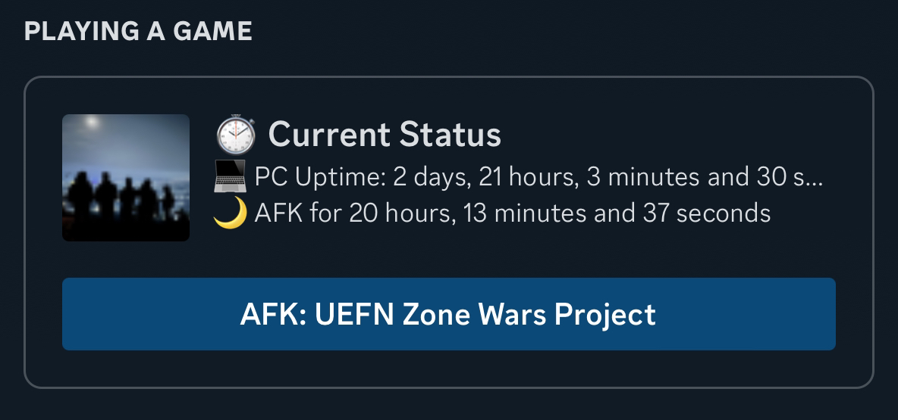
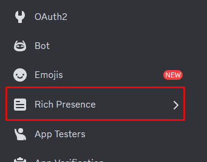
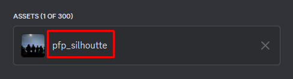

# Discord PC RPC

This python script allows users to show their current PC status on their discord profile.

# What is currently supported?

| Feature          | Supported |     Description                         |
| ---------------  | --------- | --------------------------------------- |
| System Resources |    ✅     | CPU and RAM Usage                      |
| System Uptime    |    ✅     | How long the system has been up for.   |
| AFK time         |    ✅     | How long the user is AFK for.          |
| Active time      |    ✅     | How long the user is Active for.       |
| Active window    | Partially | Which window the user is currently on.  |

***Active window isn't visible for Windows/Linux and Mac users but its visible for Mobile devices. I will fix it when I find the reason why this is happening.***

# Preview:




# Installation

- Go to Discord's [Developer Portal](https://discord.com/developers/applications)
- Click "New Application" and name it "Current Status ⏱️"
> 
- Once created, copy the "Application ID"
> 
- On the left panel, click "Rich Presence" and click "Add Images" to add the image of your choice. (**This is the image that will be visible in your profile.**)
> 

> 
- Remember the name of your image. (**This image name is necessary for the next step**)
> 
- Open the `config.json` file or create one if doesn't exist.
- In your `config.json` file, put the values you copied previously like this:

```json
{
    "client_id": "APPLICATION_ID_YOU_COPIED",
    "large_image_key": "IMAGE_NAME_YOU_COPIED",
    "url_link": "You can enter any URL here",
}
```

- Finally open the terminal and run the following to install all the dependencies:
```bash
pip install -r requirements.txt
```

# How to use?

### Once you're done with all the above steps, you can simply open the terminal and run the following to launch the script:

```bash
python rpc.py
```

### Another method to run the script is by double clicking the provided `run_rpc.bat` file.

## And VOILA! Your system status is now visible on your discord profile.